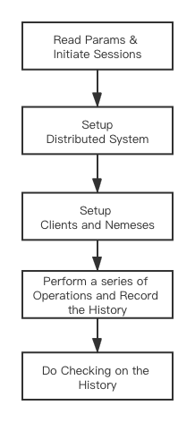
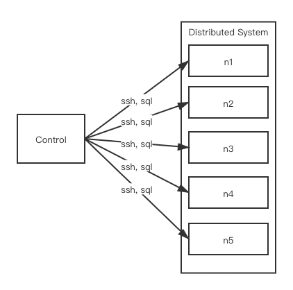

# Clojure
[Clojure](https://clojure.org/) is a member of the Lisp family of languages, a modern dialet of Lisp. The naming of variables and functions here is very different from many other language, it accepts `+ - ? # !` as a part of the naming, please see [cheatsheet](https://clojure.org/api/cheatsheet) to find out if it is a special symbol. It is a functional programming language, a compiled language, but remains completely dynamic. It "advocates immutability and immutable data structures and encourage programmers to be explicit about managing identity and its states." (from [clojure wiki](https://en.wikipedia.org/wiki/Clojure)). When running, it will first be compiled to java code, and then compiled to JAVA byte code, run by JVM. 

The code file ends with `.clj`, each should have a `(ns NAMESPACE)` definition at the very begining of the file, it is very similar to namespace in `C++`. When objects are compiled in this namespace, it will be something look like `#'NAMESPACE/VARIABLE_OR_FUNCTION`

See Clojure official site for details. **However, this tutorial require no previous knowledge on Clojure**. All the codes you write should be very direct and easy to understand, you don't need to write any complicated clojure codes (but you are welcome to learn clojure and diy!).

# Jepsen
This [tutorial](https://github.com/jepsen-io/jepsen/tree/main/doc/tutorial) is a very good place to learn more about writing the test from scratch, here only the very basic and essential concepts about jepsen will be introduced.

There are two kinds of nodes in jepsen, one is control node, on which actually runs the jepsen program, and another is... well just a bunch of nodes, no official name, that together runs your cool distributed system. During the test,there are two kinds of processes in jepsen, one is client, that will perform various operations to your system like read and write, and another is nemesis, which will do a lot of destruction and recovery to your system.



When starting a test, jepsen will first create a bunch of session threads according to the options you provide, then ssh to each node (by default 5 in total) and setup the distributed system. After that, jepsen will set up a bunch of client threads (according to the concurrency you specify in your option) and nemeses threads. Client threads do sqls to your system, and nemeses ssh to your nodes and do destruction (and recovery~).

After that, it will start doing a series of operations, like: `{:type :invoke, :op :read,  :f YOURFUNCIMPL, :value nil}` means the next operation jepsen will do is read, and will call `YOURFUNCIMPL`, which is the function you define for jepsen to run, and save the results, which is something like `{:type :ok, :value VALUE}` where `VALUE` is the returned value from the distributed system, into a history variable (so you cannot run jepsen forever, it will simply OOM). As you can see, jepsen only generates its special format of operation, you have to do the translation for your own system (but that's fine~ it will be very simple to implement via jecci, which is what it is built for~). 

After the operations are finished, jepsen will use checker (after jepsen 2.0 it will be elle) to check whether the history is correct with certain consistency models.



Clients need to be implemented, you have to tell jepsen how to connect to your system, and yes, much of them is covered by jecci. However, since there are much differences in how to destruct different systems (like which processes to kill), so you still have to implement most of the nemeses yourself.

Borrowing from TiDB, there are many workloads(tests) that can be used to test your system, and each kind of workload requires a corresponding client to be implemented, but for DBMS it should be a lot easier utilizing some general codes defined in `utils/dbms`.

# Structure
```
- jecci
  - src/jecci
    - common # Common codes
    - interface # Minimal set of functions to implement
    - utils # Some useful functions
    settings.clj # Decides which system to use
  project.clj # Project specification
```
Some important files and directories are listed above. The important one is the interface directory, here contains the minimal set of functions and variables that you need to implement, especially `db.clj`, without which you won't be able to setup your system in the very begining. The `nemesis.clj` contains the interfaces you need to implement to get the nemesis processes working. The rest are client interfaces for different kinds of workloads, if any of them could not be resolved to a correct implementation, then you wont be able to run that test.
